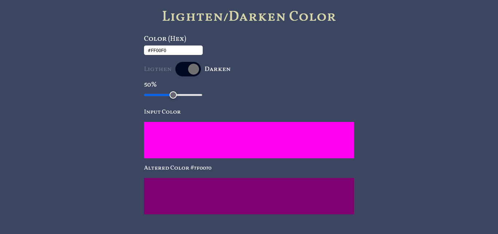

# Vanilla Javascript Color Tool

A javascript color tool that lightens or darkens colors using percentage

## Screenshot

## Built with

- Sematic HTML5 markup
- CSS custom properties
- CSS Flexbox
- Vanilla JavaScript

## Link

- Live Site URL: [Javascript Color Tool](https://jumaharun.github.io/javascript-color-tool/)
